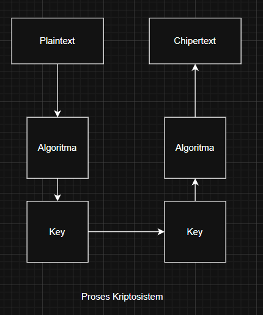
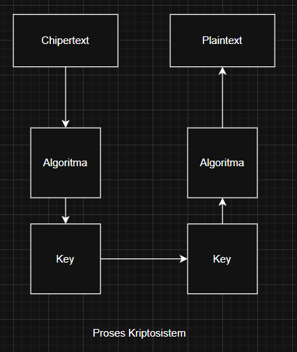

# Laporan Praktikum Kriptografi
Minggu ke-: 2
Topik: [Cryptosystem (Komponen, Enkripsi & Dekripsi, Simetris & Asimetris)]  
Nama: [Ahmad Nur Kholis]  
NIM: [220202691]  
Kelas: [5 IKKA]  

---

## 1. Tujuan
Setelah mengikuti praktikum ini, mahasiswa diharapkan mampu:

1. engidentifikasi komponen dasar kriptosistem (plaintext, ciphertext, kunci, algoritma).
2. Menggambarkan proses enkripsi dan dekripsi sederhana.
3. Mengklasifikasikan jenis kriptosistem (simetris dan asimetris).

## 2. Dasar Teori
    A. langkah 1
        a. Plaintext to Chipertext
        
        b. Chipertext to Plaintext
        
    B. langkah 2
        Ada pada code simple_crypto.py
    C. Langkah 3
        a. Kriptografi Simetris

            Kriptografi simetris menggunakan satu kunci yang sama untuk proses enkripsi dan dekripsi. Artinya, pengirim dan penerima pesan harus sama-sama mengetahui dan menjaga kerahasiaan kunci tersebut. Metode ini cepat dan efisien, sehingga cocok untuk mengenkripsi data dalam jumlah besar.

            Namun, kelemahannya adalah pada distribusi kunci — karena jika kunci sampai bocor, seluruh komunikasi bisa dibaca oleh pihak yang tidak berwenang.

            Contoh algoritma simetris:

                - AES (Advanced Encryption Standard) → digunakan secara luas pada sistem keamanan modern, seperti HTTPS dan VPN.

                - DES (Data Encryption Standard) → algoritma lama berbasis blok 56-bit, kini sudah jarang digunakan karena dianggap kurang aman.
        b. Kriptografi Asimetris

            Kriptografi asimetris menggunakan dua kunci berbeda:

                - Kunci publik (public key) untuk enkripsi

                -Kunci privat (private key) untuk dekripsi

            Kunci publik dapat dibagikan secara bebas, sedangkan kunci privat harus dijaga kerahasiaannya. Sistem ini lebih aman untuk pertukaran kunci dan autentikasi, tetapi prosesnya lebih lambat dibanding simetris karena perhitungan matematikanya kompleks.

            Contoh algoritma asimetris:

                - RSA (Rivest–Shamir–Adleman) → algoritma populer untuk tanda tangan digital dan pertukaran kunci.

                - CC (Elliptic Curve Cryptography) → menawarkan keamanan tinggi dengan ukuran kunci yang lebih kecil dibanding RSA.
PERTANAYAAN DISKUSI !
1. Komponen Utama dalam Sebuah Kriptosistem

    - Sebuah kriptosistem terdiri dari beberapa komponen utama yang bekerja bersama untuk mengamankan data, yaitu:

    - Plaintext → pesan asli atau data sebelum dienkripsi.

    - Ciphertext → hasil enkripsi, yaitu pesan yang sudah diacak sehingga tidak dapat dibaca tanpa kunci.

    - Algoritma enkripsi dan dekripsi → prosedur matematika yang digunakan untuk mengubah plaintext menjadi ciphertext dan sebaliknya.

    - Kunci (key) → nilai rahasia yang digunakan oleh algoritma untuk melakukan proses enkripsi/dekripsi.

    - Proses enkripsi → transformasi dari plaintext ke ciphertext menggunakan algoritma dan kunci.

    - Proses dekripsi → mengembalikan ciphertext ke plaintext menggunakan kunci yang sesuai.
2.  Kelebihan dan Kelemahan Sistem Simetris dibandingkan Asimetris

    Kriptografi simetris memakai satu kunci yang sama untuk enkripsi dan dekripsi. Sistem ini lebih cepat dan efisien, cocok untuk data besar, tetapi kurang aman karena kuncinya harus dibagikan secara rahasia.

    Sebaliknya, kriptografi asimetris memakai dua kunci berbeda — publik dan privat. Sistem ini lebih aman dalam distribusi kunci, namun lebih lambat karena proses enkripsinya lebih kompleks.
3. Mengapa Distribusi Kunci Menjadi Masalah Utama dalam Kriptografi Simetris (Versi Ringkas)

    Distribusi kunci menjadi masalah utama dalam kriptografi simetris karena pengirim dan penerima harus berbagi kunci rahasia yang sama. Jika kunci tersebut disadap saat dikirim, maka keamanan seluruh komunikasi akan terancam, sebab siapa pun yang memiliki kunci itu dapat membaca semua pesan terenkripsi.